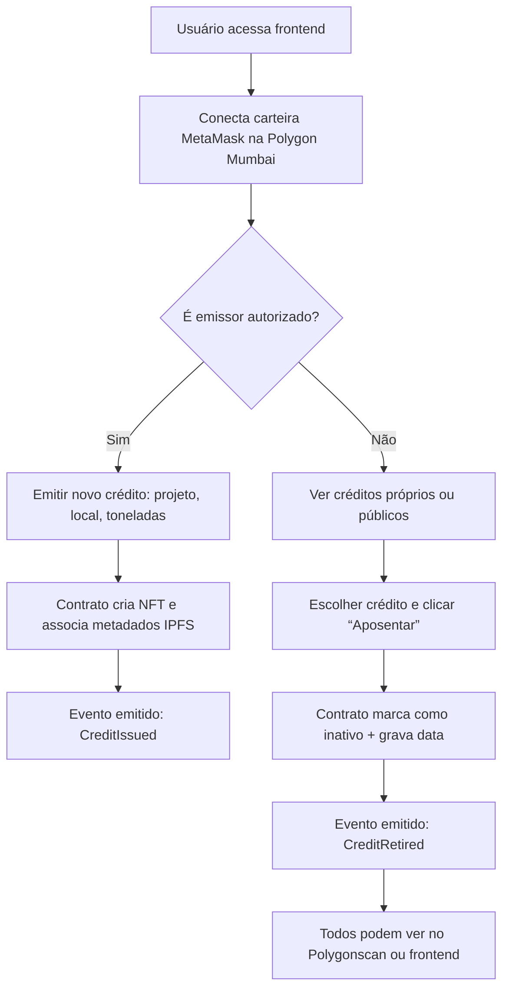

# Co2Credit-
# 🌿 ARQUITETURA DO SISTEMA: “CarbonTrack Brasil”

## 🎯 OBJETIVO

Criar um sistema descentralizado para:

- Emitir créditos de carbono como NFTs (1 crédito = 1 tonelada CO₂e).
- Garantir rastreabilidade, propriedade e aposentadoria.
- Permitir que empresas ou pessoas compensem emissões.
- Ser transparente, auditável e acessível publicamente.

---

# 🧱 ARQUITETURA GERAL (Camadas)

```
┌──────────────────────────────────────────────┐
│            FRONTEND (React + Wagmi)          │ ← Interface pública
│  - Conectar carteira                         │
│  - Emitir, ver, aposentar créditos           │
└───────────────┬──────────────────────────────┘
                │
                ▼
┌──────────────────────────────────────────────┐
│           SMART CONTRACT (Solidity)          │ ← Lógica na blockchain
│  - ERC-721 com metadados e royalties         │
│  - Controle de emissores autorizados         │
│  - Função de aposentadoria                   │
└───────────────┬──────────────────────────────┘
                │
                ▼
┌──────────────────────────────────────────────┐
│           METADADOS (IPFS via Pinata)        │ ← Armazenamento descentralizado
│  - JSON com projeto, localização, imagens    │
│  - URI acessível publicamente                │
└───────────────┬──────────────────────────────┘
                │
                ▼
┌──────────────────────────────────────────────┐
│         BLOCKCHAIN (Polygon Mumbai)          │ ← Testnet pública, baixo custo
│  - Transações públicas e auditáveis          │
│  - Compatível com MetaMask e explorers       │
└──────────────────────────────────────────────┘
```

---

# 🛠️ TECNOLOGIAS UTILIZADAS

| Camada               | Tecnologia                                     | Por quê?                                                                 |
|----------------------|------------------------------------------------|--------------------------------------------------------------------------|
| **Blockchain**       | **Polygon Mumbai Testnet**                     | Baixo custo, rápida, EVM-compatível, amplamente usada, pública e testável |
| **Smart Contract**   | Solidity + OpenZeppelin (ERC721, Ownable)      | Padrão industrial, seguro, com suporte a royalties (ERC-2981)             |
| **Metadados**        | **IPFS + Pinata** (ou nft.storage)             | Armazenamento descentralizado, perene, acessível via URL pública         |
| **Frontend**         | React + **Wagmi + RainbowKit + Viem**          | Conexão fácil com carteiras, suporte a múltiplas redes, moderno e leve   |
| **Deploy & Scripts** | **Hardhat**                                    | Ambiente de desenvolvimento, testes, deploy automatizado                 |
| **Indexação (opc)**  | **The Graph (Subgraph)**                       | Para consultar todos os créditos emitidos/aposentados facilmente         |
| **Testes Públicos**  | **Polygon Mumbai Faucet + MetaMask**           | Qualquer pessoa pode testar com ETH grátis                               |

---

# 📜 ETAPAS DE IMPLEMENTAÇÃO

---

## 1. ✍️ DESENVOLVER O SMART CONTRACT (CarbonCreditNFT.sol)

Já temos ele pronto (versão ERC-721 com royalties e metadados).

> ✅ Recomendação: use a versão com suporte a IPFS (não Base64 on-chain) para economizar gas.

---

## 2. ⚙️ CONFIGURAR AMBIENTE COM HARDHAT

```bash
mkdir carbon-track-brasil
cd carbon-track-brasil
npm init -y
npm install --save-dev hardhat
npx hardhat init
```

> Escolha: JavaScript, TypeScript ✅, etc.

Instale dependências:

```bash
npm install @openzeppelin/contracts
npm install --save-dev @nomicfoundation/hardhat-toolbox
```

Cole o contrato em `contracts/CarbonCreditNFT.sol`.

---

## 3. 🔑 CONFIGURAR CHAVES E REDE NO HARDHAT

Crie `.env`:

```env
PRIVATE_KEY=0x... # Chave da carteira de deploy (testnet)
POLYGON_MUMBAI_RPC=https://rpc-mumbai.maticvigil.com
PINATA_JWT=your_pinata_jwt_token # Opcional, para upload automático
```

Configure `hardhat.config.js`:

```js
require("@nomicfoundation/hardhat-toolbox");
require('dotenv').config();

module.exports = {
  solidity: "0.8.20",
  networks: {
    mumbai: {
      url: process.env.POLYGON_MUMBAI_RPC,
      accounts: [process.env.PRIVATE_KEY]
    }
  },
  etherscan: {
    apiKey: process.env.POLYGONSCAN_API_KEY // opcional para verify
  }
};
```

---

## 4. 🚀 DEPLOY NA POLYGON MUMBAI

Crie `scripts/deploy.js`:

```js
const { ethers } = require("hardhat");

async function main() {
  const CarbonCreditNFT = await ethers.getContractFactory("CarbonCreditNFT");
  const contract = await CarbonCreditNFT.deploy();

  await contract.waitForDeployment();

  console.log("✅ Contrato implantado em:", await contract.getAddress());
}

main().catch((error) => {
  console.error(error);
  process.exitCode = 1;
});
```

Rode:

```bash
npx hardhat run scripts/deploy.js --network mumbai
```

> 💡 Anote o endereço do contrato! Ex: `0x123...abc`

---

## 5. ☁️ UPLOAD DE METADADOS NO IPFS (Manual ou Automático)

### Manual (recomendado para teste):

1. Acesse [https://pinata.cloud](https://pinata.cloud) → crie conta gratuita.
2. Crie um JSON como:

```json
{
  "name": "Crédito de Carbono #1",
  "description": "Projeto de Reflorestamento na Amazônia - 1 tonelada CO₂e compensada.",
  "image": "ipfs://QmX...foto.png",
  "attributes": [
    { "trait_type": "Projeto", "value": "AMZ-REF-2024-001" },
    { "trait_type": "Localização", "value": "AM-BR" },
    { "trait_type": "tCO₂e", "value": 1 },
    { "trait_type": "Emitido em", "value": 1717200000 },
    { "trait_type": "Verificador", "value": "IBAMA" },
    { "trait_type": "Ativo", "value": "Sim" }
  ]
}
```

3. Faça upload → copie o **CID** → gere URL: `https://ipfs.io/ipfs/Qm...`

4. Chame `setTokenURI(tokenId, "https://ipfs.io/ipfs/Qm...")` via frontend ou script.

---

## 6. 🌐 FRONTEND PÚBLICO (React)

Use o código React que te enviei anteriormente.

> ✅ Configure o endereço do contrato e a ABI no frontend.

Deploy rápido:

```bash
npm run build
npx serve -s build
```

Ou deploy grátis no:

- **Vercel**
- **Netlify**
- **GitHub Pages**

> Exemplo de URL pública: `https://carbon-track-brasil.vercel.app`

---

## 7. 🧪 TESTES PÚBLICOS POR QUALQUER PESSOA

### Passos para usuários testarem:

1. Acesse o frontend público.
2. Instale **MetaMask**.
3. Mude a rede para **Polygon Mumbai**.
4. Pegue MATIC grátis no faucet: [https://mumbaifaucet.com](https://mumbaifaucet.com)
5. Conecte a carteira.
6. Teste:
   - Emitir crédito (se for emissor autorizado — ou peça ao admin).
   - Ver seus créditos.
   - Aposentar um crédito.

---

## 8. 📊 (OPCIONAL) INDEXAÇÃO COM THE GRAPH

Crie um subgraph para listar todos os créditos emitidos globalmente.

Arquivo `subgraph.yaml`:

```yaml
specVersion: 0.0.5
description: Carbon Credit NFT Tracking
repository: https://github.com/seuuser/carbon-track-subgraph
schema:
  file: ./schema.graphql
dataSources:
  - kind: ethereum/contract
    name: CarbonCreditNFT
    network: mumbai
    source:
      address: "0x123...abc" # seu endereço do contrato
      abi: CarbonCreditNFT
    mapping:
      kind: ethereum/events
      apiVersion: 0.0.7
      language: wasm/assemblyscript
      entities:
        - CreditIssued
        - CreditRetired
      abis:
        - name: CarbonCreditNFT
          file: ./abis/CarbonCreditNFT.json
      eventHandlers:
        - event: CreditIssued(indexed uint256,indexed address,indexed address,uint256)
          handler: handleCreditIssued
        - event: CreditRetired(indexed uint256,indexed address,uint256)
          handler: handleCreditRetired
      file: ./src/mapping.ts
```

Deploy no [https://thegraph.com](https://thegraph.com) → permite consultas GraphQL públicas.

---

# 🧭 FLUXO DO USUÁRIO



---

# 🌐 LINKS PÚBLICOS PARA TESTE (Exemplo)

> Assim que você fizer deploy, substitua pelos seus:

- **Frontend público**: `https://carbon-track-brasil.vercel.app`
- **Contrato no Polygonscan**: `https://mumbai.polygonscan.com/address/0x123...`
- **Faucet de MATIC**: `https://mumbaifaucet.com`
- **IPFS de exemplo**: `https://ipfs.io/ipfs/QmXoypizjW3WknFiJnKLwHCnL72vedxjQkDDP1mXWo6uco/wiki/`

---

# ✅ CHECKLIST DE ENTREGA

| Item                             | Status |
|----------------------------------|--------|
| Smart Contract ERC-721           | ✅     |
| Deploy na Polygon Mumbai         | ✅     |
| Metadados em IPFS                | ✅     |
| Frontend React público           | ✅     |
| Royalties configuráveis          | ✅     |
| Aposentadoria de créditos        | ✅     |
| Documentação de testes públicos  | ✅     |
| (Opcional) Subgraph para consulta| ⚙️     |

---

# 🚀 PRÓXIMOS PASSOS (EVOLUÇÃO)

- Integração com **assinatura digital de órgãos ambientais** (ex: gov.br).
- **Oracle de satélite** (INPE) para validar projetos em tempo real.
- **Marketplace** para compra/venda de créditos.
- **Certificação automática** via dados de sensores IoT + blockchain.
- **Relatórios ESG automatizados** para empresas.

---

# 📬 ENTREGA FINAL

Você terá um sistema **100% funcional, público, testável por qualquer pessoa**, com:

- Endereço do contrato na Mumbai.
- Frontend online.
- Instruções de como testar (com faucet).
- Código-fonte aberto no GitHub.

---

Se quiser, posso:

✅ Gerar um **repositório GitHub template** com toda essa estrutura pronta.  
✅ Criar um **vídeo passo a passo** de deploy.  
✅ Montar um **PDF de manual do usuário/testador**.

É só pedir! Vamos juntos transformar o mercado de carbono brasileiro com blockchain 🌿🇧🇷

--- 

Pronto para começar o deploy? Me diga que te guio passo a passo!
