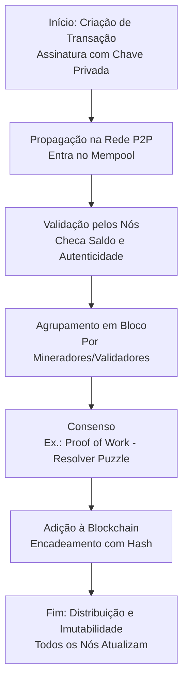
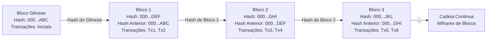
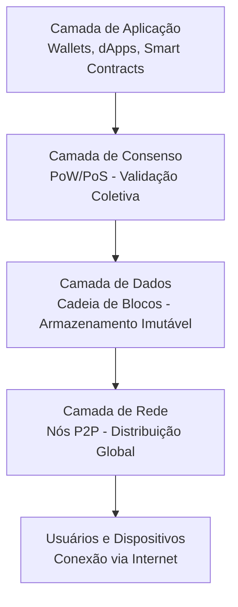

# Funcionamento de uma Blockchain: Estrutura e Arquitetura

Uma blockchain é uma tecnologia que permite registrar transações ou dados de forma **segura, imutável e descentralizada**.
Basicamente é *"caderno digital coletivo"* mantido por milhares de computadores (chamados de "nós") espalhados pelo mundo,
sem um dono central – como um Google Docs onde ninguém pode apagar ou alterar entradas antigas sem o acordo de todos. 
Ela foi inventada em 2008 por Satoshi Nakamoto para o Bitcoin, mas hoje é usada em criptomoedas, contratos inteligentes, 
rastreamento de suprimentos e até eleições digitais.

## 1. Como Funciona uma Blockchain? (Funcionamento Passo a Passo)
O funcionamento gira em torno de transações que são agrupadas em blocos, validadas por consenso e encadeadas. Vamos ao workflow básico.

- **Passo 1: Criação de Transação**: Alguém (ex.: você) inicia uma ação, como transferir criptomoeda. Isso é assinado com uma chave privada (como uma senha criptografada) para provar autenticidade.
- **Passo 2: Propagação na Rede**: A transação é enviada para a rede P2P, onde nós a recebem e verificam (ex.: se você tem saldo suficiente, evitando "gastar duas vezes" o mesmo dinheiro).
- **Passo 3: Agrupamento em Bloco**: Transações válidas são agrupadas em um "bloco" por participantes especiais (mineradores ou validadores).
- **Passo 4: Consenso e Validação**: A rede usa um mecanismo (ex.: Proof of Work) para concordar que o bloco é válido. Isso envolve resolver um puzzle computacional para "selar" o bloco.
- **Passo 5: Encadeamento e Distribuição**: O bloco é adicionado à cadeia, e todos os nós atualizam suas cópias. Qualquer alteração posterior seria detectada imediatamente.

**Diagrama de Workflow: Fluxo Geral de Funcionamento**

O "Mempool" é como uma fila de tarefas pendentes em um sistema operacional.

## 2. Estrutura de uma Blockchain
A estrutura é uma "cadeia de blocos" (daí o nome "blockchain"). Cada bloco é como um arquivo em um diretório encadeado.

- **Componentes de um Bloco**:
  - **Header (Cabeçalho)**: Metadados como versão, timestamp (data/hora), nonce (número aleatório para o puzzle), e o **hash do bloco anterior** – isso cria o encadeamento.
  - **Transações**: Lista de ações (ex.: "Alice envia 1 BTC para Bob").
  - **Àrvore Merkle**: Uma árvore de hashes que resume as transações para verificação rápida (como um índice em um banco de dados).
- **Imutabilidade**: Graças aos hashes (funções criptográficas como SHA-256), alterar um bloco muda seu hash, quebrando a cadeia inteira – como alterar um arquivo e invalidar todos os links simbólicos subsequentes.
- **Tamanho e Limites**: Blocos têm tamanho fixo (ex.: 1 MB no Bitcoin) para eficiência de rede.

**Diagrama de Workflow: Estrutura de Blocos Encadeados**

Cada caixa representa um bloco, e as setas mostram como os hashes conectam tudo, como links em uma lista encadeada em programação.

## 3. Arquitetura de uma Blockchain
A arquitetura é descentralizada, baseada em uma rede distribuída.

- **Camadas Principais**:
  - **Camada de Rede**: Nós conectados via P2P, como em torrents – cada nó armazena uma cópia completa da blockchain.
  - **Camada de Consenso**: Mecanismos como Proof of Work (PoW: mineradores competem com CPU/GPU) ou Proof of Stake (PoS: validadores "apostam" cripto). Isso resolve o "problema dos generais bizantinos" – garantir acordo em uma rede não confiável.
  - **Camada de Dados**: A cadeia de blocos em si, armazenada localmente ou em nuvem distribuída.
  - **Camada de Aplicação**: Interfaces como wallets (carteiras) ou smart contracts (códigos autoexecutáveis, como scripts em um servidor).
- **Tipos de Blockchain**: 
  - **Pública/Permissionless**: Qualquer um participa (ex.: Bitcoin) – aberta como a internet.
  - **Privada/Permissioned**: Controlada por uma entidade (ex.: para empresas) – como uma intranet.
- **Desafios**: Escalabilidade (ex.: Bitcoin processa ~7 transações/segundo vs. Visa's 24.000), consumo energético (PoW) e segurança contra ataques (ex.: 51% attack, onde alguém controla a maioria da rede).

**Diagrama de Workflow: Arquitetura em Camadas**

#### Considerações Finais
Essa é a base de uma blockchain: um sistema robusto que combina criptografia, redes distribuídas e consenso para criar confiança sem autoridades centrais. Para leigos com fundo em informática, pense nela como um banco de dados NoSQL replicado com triggers criptográficos. Se quiser exemplos reais (ex.: como o Ethereum adiciona smart contracts) ou aprofundar em código (ex.: simular uma blockchain simples em Python), pergunte!
