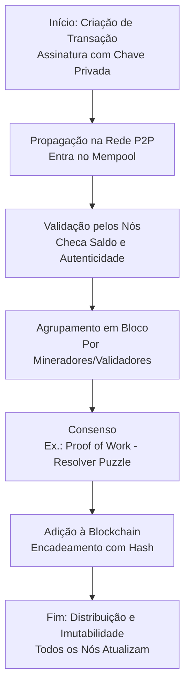
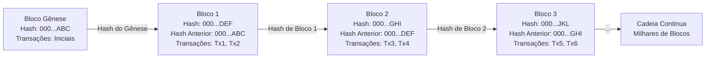
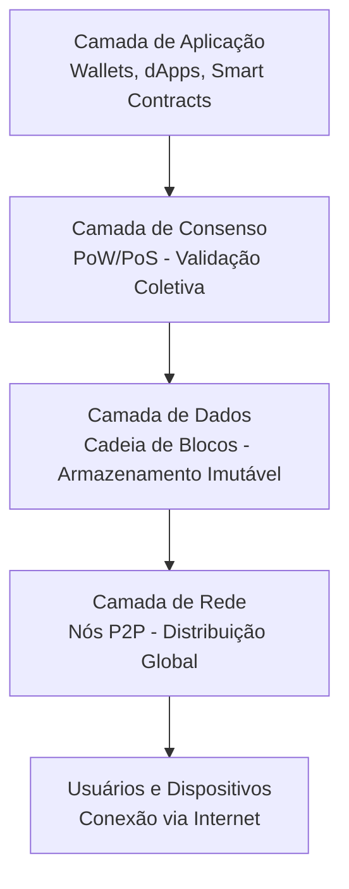

# Funcionamento de uma Blockchain: Estrutura e Arquitetura

Uma blockchain é uma tecnologia que permite registrar transações ou dados de forma **segura, imutável e descentralizada**.
Basicamente é *"caderno digital coletivo"* mantido por milhares de computadores (chamados de "nós") espalhados pelo mundo,
sem um dono central – como um Google Docs onde ninguém pode apagar ou alterar entradas antigas sem o acordo de todos.
Ela foi inventada em 2008 por Satoshi Nakamoto para o Bitcoin, mas hoje é usada em criptomoedas, contratos inteligentes,
rastreamento de suprimentos e até eleições digitais.

## 1. Como Funciona uma Blockchain? (Funcionamento Passo a Passo)

O funcionamento gira em torno de transações que são agrupadas em blocos, validadas por consenso e encadeadas. Vamos ao workflow básico.

- **Passo 1: Criação de Transação**: Alguém (ex.: você) inicia uma ação, como transferir criptomoeda. Isso é assinado com uma chave privada (como uma senha criptografada) para provar autenticidade.
- **Passo 2: Propagação na Rede**: A transação é enviada para a rede P2P, onde nós a recebem e verificam (ex.: se você tem saldo suficiente, evitando "gastar duas vezes" o mesmo dinheiro).
- **Passo 3: Agrupamento em Bloco**: Transações válidas são agrupadas em um "bloco" por participantes especiais (mineradores ou validadores).
- **Passo 4: Consenso e Validação**: A rede usa um mecanismo (ex.: Proof of Work) para concordar que o bloco é válido. Isso envolve resolver um puzzle computacional para "selar" o bloco.
- **Passo 5: Encadeamento e Distribuição**: O bloco é adicionado à cadeia, e todos os nós atualizam suas cópias. Qualquer alteração posterior seria detectada imediatamente.

**Diagrama de Workflow: Fluxo Geral de Funcionamento**

O "Mempool" é como uma fila de tarefas pendentes em um sistema operacional.

## 2. Estrutura de uma Blockchain

A estrutura é uma "cadeia de blocos" (daí o nome "blockchain"). Cada bloco é como um arquivo em um diretório encadeado.

- **Componentes de um Bloco**:
  - **Header (Cabeçalho)**: Metadados como versão, timestamp (data/hora), nonce (número aleatório para o puzzle), e o **hash do bloco anterior** – isso cria o encadeamento.
  - **Transações**: Lista de ações (ex.: "Alice envia 1 BTC para Bob").
  - [**Àrvore Merkle**](merkle.md): Uma árvore de hashes que resume as transações para verificação rápida (como um índice em um banco de dados).
- **Imutabilidade**: Graças aos hashes (funções criptográficas como SHA-256), alterar um bloco muda seu hash, quebrando a cadeia inteira – como alterar um arquivo e invalidar todos os links simbólicos subsequentes.
- **Tamanho e Limites**: Blocos têm tamanho fixo (ex.: 1 MB no Bitcoin) para eficiência de rede.

**Diagrama de Workflow: Estrutura de Blocos Encadeados**

Cada caixa representa um bloco, e as setas mostram como os hashes conectam tudo, como links em uma lista encadeada em programação.

## 3. Arquitetura de uma Blockchain

A arquitetura é descentralizada, baseada em uma rede distribuída.

- **Camadas Principais**:
  - **Camada de Rede**: Nós conectados via P2P, como em torrents – cada nó armazena uma cópia completa da blockchain.
  - **Camada de Consenso**: Mecanismos como Proof of Work (PoW: mineradores competem com CPU/GPU) ou Proof of Stake (PoS: validadores "apostam" cripto). Isso resolve o "problema dos generais bizantinos" – garantir acordo em uma rede não confiável.
  - **Camada de Dados**: A cadeia de blocos em si, armazenada localmente ou em nuvem distribuída.
  - **Camada de Aplicação**: Interfaces como wallets (carteiras) ou smart contracts (códigos autoexecutáveis, como scripts em um servidor).
- **Tipos de Blockchain**:
  - **Pública/Permissionless**: Qualquer um participa (ex.: Bitcoin) – aberta como a internet.
  - **Privada/Permissioned**: Controlada por uma entidade (ex.: para empresas) – como uma intranet.
- **Desafios**: Escalabilidade (ex.: Bitcoin processa ~7 transações/segundo vs. Visa's 24.000), consumo energético (PoW) e segurança contra ataques (ex.: 51% attack, onde alguém controla a maioria da rede).

**Diagrama de Workflow: Arquitetura em Camadas**

## 4. Vamos praticar?

Vou sugerir **uma atividade simples e interativa** que você pode fazer em minutos, usando ferramentas gratuitas online. Em seguida, indico **sites de monitoramento (block explorers)** que rastreiam blocos em formação ao vivo. Esses sites são como "painéis de controle" da blockchain, mostrando métricas em tempo real, como o tempo médio para formar um bloco (ex.: ~10 minutos no Bitcoin). Baseio-me em fontes confiáveis de exploradores de blockchain para garantir precisão.

### 4.1 Atividade Sugerida: "Monitore a Formação de Blocos do Bitcoin em Tempo Real" (Duração: 15-30 minutos)

Essa atividade é para demonstrar o fluxo: transações → agrupamento → mineração/consenso → novo bloco. Você não precisa de software; basta um navegador web.

O objetivo é observar como blocos "se formam" a cada ~10 minutos, visualizando transações sendo processadas e adicionadas à cadeia.

**Materiais Necessários**:

- Um computador com internet.
- Opcional: Um timer ou app de cronômetro para medir o tempo entre blocos.

**Passos da Atividade** (Faça isso em grupo ou sozinho para discutir observações):

1. **Escolha uma Blockchain para Monitorar**: Comece com o Bitcoin, pois é simples e estável. (Para algo mais dinâmico, use Ethereum, que forma blocos a cada ~12 segundos.)

2. **Acesse um Block Explorer**: Vá para um site como o Mempool.space (para Bitcoin) ou Etherscan.io (para Ethereum). Esses sites mostram o mempool (fila de transações pendentes) e o último bloco em formação.
   - No Mempool.space: Clique em "Live" para ver transações chegando em tempo real.
   - No Etherscan: Vá para "Blocks" e ative o "Auto Refresh" para atualizações automáticas.

3. **Observe o Processo de Formação**:
   - **Passo 3.1: Mempool em Ação**: Veja o "mempool" – uma lista de transações aguardando (ex.: transferências de BTC). Note quantas transações há (pode ser milhares) e o tamanho total (em MB). Isso é o "agrupamento inicial".
   - **Passo 3.2: Mineração/Validação**: Os mineradores (ou validadores) competem para "selar" o bloco. Monitore o "Next Block" ou "Mining Progress" – um contador mostra o tempo restante (ex.: "Próximo bloco em 4:32 min").
   - **Passo 3.3: Formação do Bloco**: Quando o bloco é minerado, ele aparece na lista de "Latest Blocks". Clique nele para ver:
     - Número do bloco (ex.: Bloco #860.000).
     - Transações incluídas (centenas ou milhares).
     - Hash (a "impressão digital" única).
     - Recompensa ao minerador (ex.: 3.125 BTC + taxas).
   - **Passo 3.4: Encadeamento**: Note como o novo bloco referencia o anterior via hash, formando a "cadeia".

4. **Registre e Analise**:
   - Anote o horário do último bloco e espere o próximo. Meça o tempo real vs. esperado (~10 min para Bitcoin).
   - Perguntas para Reflexão: Por que alguns blocos demoram mais? (Dificuldade de mineração ajusta-se automaticamente.) Como o tamanho do mempool afeta as taxas de transação?
   - **Extensão Educativa**: Compare com Ethereum (mais rápido) para discutir Proof of Stake vs. Proof of Work.

### 4.2 Sites que Monitoram a Formação de Blocos em Tempo Real

Existem dezenas de "block explorers" gratuitos e confiáveis que rastreiam blockchains públicas como Bitcoin, Ethereum e outras. Eles atualizam dados a cada poucos segundos, mostrando blocos em formação, mempools e métricas de rede. Aqui vai uma tabela com os melhores, selecionados por usabilidade e popularidade (baseado em fontes recentes).

| Site/Explorador          | Blockchain Principal | Recursos para Monitorar Blocos | Link Direto |
|---------------------------|----------------------|--------------------------------|-------------|
| **Mempool.space**        | Bitcoin             | Mempool ao vivo, progresso de mineração, visualizações em tempo real (melhor para iniciantes). | [mempool.space](https://mempool.space/) |
| **Blockchain.com Explorer** | Bitcoin, Ethereum, etc. | Busca por blocos, transações e gráficos de taxa; app móvel disponível. | [blockchain.com/explorer](https://www.blockchain.com/explorer) |
| **Blockstream.info**     | Bitcoin, Liquid     | Dados detalhados de blocos, suporte a Tor para privacidade; open-source. | [blockstream.info](https://blockstream.info/) |
| **Etherscan.io**         | Ethereum            | Blocos em formação, gas prices, mempool; ideal para smart contracts. | [etherscan.io/blocks](https://etherscan.io/blocks) |
| **Blockchair.com**       | Múltiplas (BTC, ETH, etc.) | Filtros avançados, API gratuita; compara blockchains. | [blockchair.com](https://blockchair.com/) |
| **BlockCypher**          | Bitcoin, Ethereum   | Estimativas de fees em tempo real; rápido para transações recentes. | [live.blockcypher.com/btc](https://live.blockcypher.com/btc/) |

### 4.3 Quer minerar?

Existe um software que facilita a mineração: o [NiceHash](https://www.nicehash.com/).
O NiceHash não é uma pool de mineração tradicional, mas sim um mercado de poder de hash (hashrate marketplace), que atua como uma ponte entre mineradores e compradores de capacidade computacional. Em essência, ele permite que indivíduos vendam ou comprem poder de processamento para minerar criptomoedas, facilitando a democratização dessa atividade sem a necessidade de hardware próprio para todos os envolvidos.
Essa plataforma foi lançada em 2014 e ganhou popularidade por sua simplicidade, especialmente após superar um hack notório em 2017. Hoje, em 2025, continua sendo uma das líderes em mineração em nuvem, com ferramentas como o NiceHash Miner e o EasyMining, que otimizam o processo para usuários iniciantes e avançados.

Vai [aqui](https://www.nicehash.com/mining) para calcular sua estimativa de ganho.
